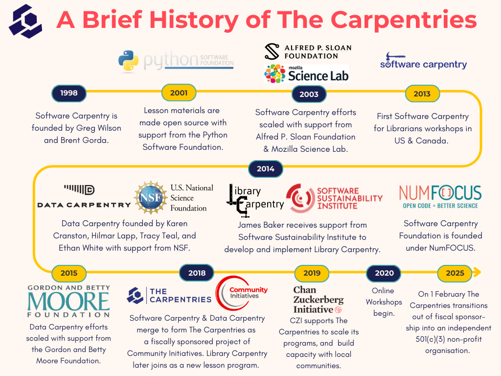

# 1. Welcome

## Staff

- Tutor: Leighton Pritchard
- Helpers: Lewis Kelly, William Kerr

::: { .callout-tip title="Sticky note status indicators" }
- Use the **RED** sticky note to indicate that an issue/you want to talk to a helper
- Use the **ORANGE** sticky note to indicate that things are good/you've finished an exercise

{#fig-sticky-notes}
:::

# 2. The Carpentries

## What is/are The Carpentries?

::: { .callout-tip title="Non-profit organisation teaching foundational coding and data science skills to researchers" }
These skills are often not included in research training, for many disciplines
:::

::: { .callout-note title="A global community" }
- Open-source, collaboratively-built lessons
- Evidence-based pedagogy
- Live coding, "learn-by-doing"
- Supportive culture ([code of conduct](https://docs.carpentries.org/policies/coc/))
:::

::: { .callout-caution title="Advocacy for open source, reproducible research software and data practices" }
:::

::: { .footer }
[https://carpentries.org/about-us/](https://carpentries.org/about-us/)
:::

## Carpentries timeline

{#fig-carpentries-timeline}

# 3. Schedule

## Schedule

| Day | Session | Topic |
| :-- | :------ | :---- |
| Tuesday | AM | Shell |
| Tuesday | PM | R part 1 |
| Wednesday | AM | OpenRefine |
| Wednesday | PM | R part 2 |

::: { .callout-tip title="Breaks"}
- Morning coffee/pastries: 0930-1000
- Morning break: 1100-1115
- Lunch: 1215-1300
- Afternoon tea/coffee: 1430-1450
:::

::: { .callout-important title="Fire alarm test Tuesday morning" }
:::

::: { .footer }
[https://sipbs-compbiol.github.io/2025-11-04-strathclyde/](https://sipbs-compbiol.github.io/2025-11-04-strathclyde/)
:::

# 4. Questions?