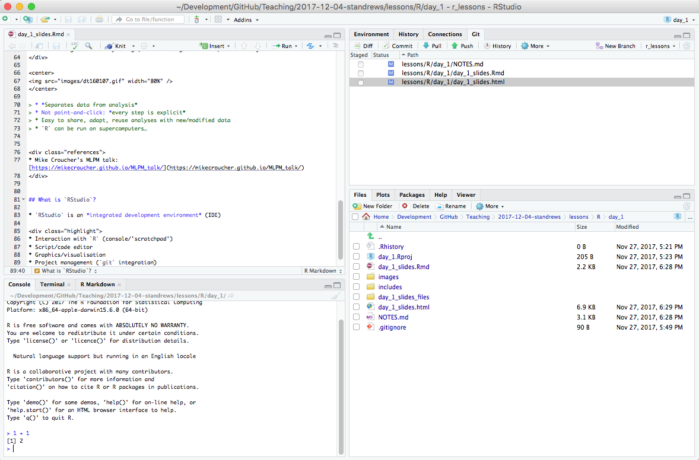
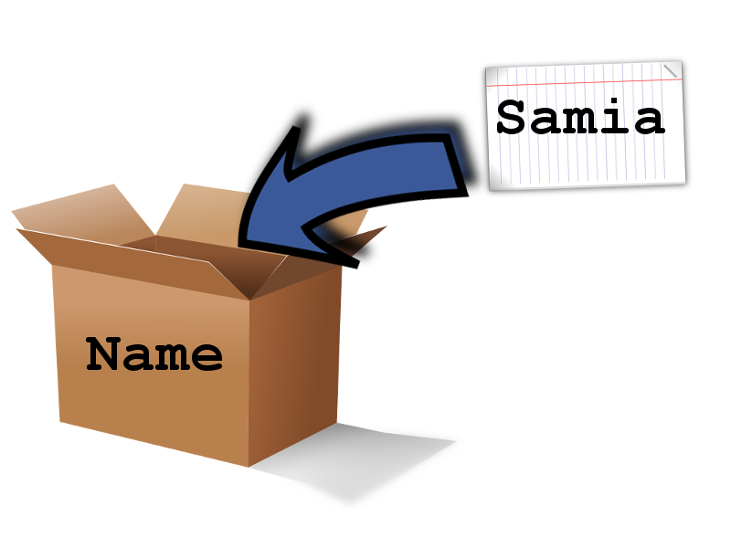
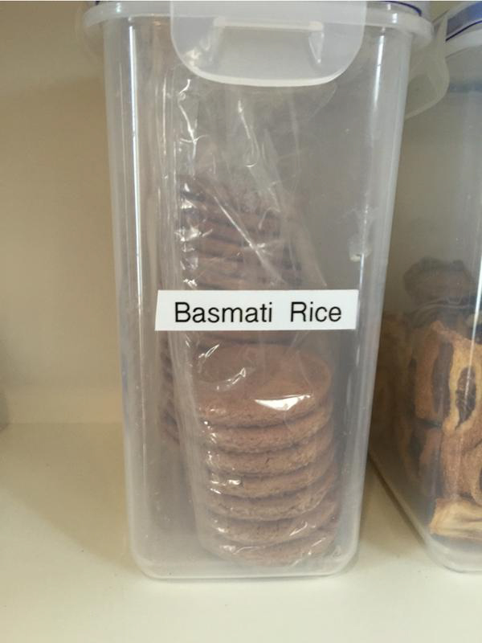
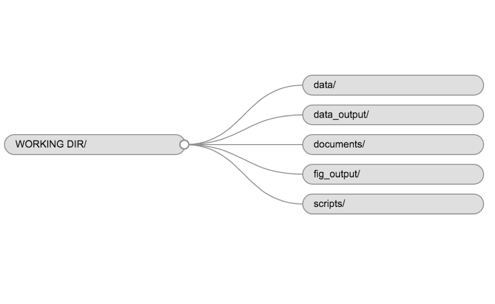

```{r}
#| label: setup

library(kableExtra)
library(tidyverse)
```

# 1. Summary and Setup

## Software and files

:::: { .columns }

::: { .column width="50%" }

- University PC: use `RStudio`
- Own laptop: use `RStudio`

::: { .callout-important }
- You will need to have the latest version of `R` on your machine
  - [https://www.r-project.org/](https://www.r-project.org/)
- You will need to have the latest version of `RStudio` on your machine
  - [https://www.rstudio.com/products/rstudio/download/#download](https://www.rstudio.com/products/rstudio/download/#download)
:::

:::

::: { .column width="25%" }
{#fig-r-download}
:::

::: { .column width="25%" }
{#fig-rstudio-download}
:::

::::

## Learning Objectives

- Fundamentals of `R` and `RStudio`
- Fundamentals of programming (in `R`)
- Data management with the `tidyverse`
- Publication-quality data visualisation with `ggplot2`
- Reporting with `RMarkdown`

# 2. Introduction to R

## What is R?

::: { .callout-note }
## `R` is

- a programming language
- the software that interprets/runs programs written in the `R` language
:::

::: { .callout-tip }
## Why use `R`?

- free (though commercial support can be bought)
- widely used
  - sciences, humanities, engineering, statistics, etc.
- has many excellent specialised packages for data analysis and visualisation
- international, friendly user community
:::

::: { .footer }
- RStudio community support: <https://community.rstudio.com/>
- Stack Overflow: <https://stackoverflow.com/>
:::


## What is RStudio?

::: { .callout-tip }
## `RStudio` is an *integrated development environment* (IDE)

:::: { .columns }

::: { .column width="50%" }
{#fig-rstudio-window}
:::

::: { .column width="40%" }
{#fig-rstudio-screenshot}
:::

::::

:::

::: { .callout-important }
## Interactive Demo

Please start `RStudio` on your own machine
:::


## Variables

::: { .callout-warning }
## Variables are like *named boxes*

- An item (*object*) of data goes in the box (which is called `Name`)
- When we refer to the box (*variable*) by its name, we usually mean *what's in the box*

{#fig-box-variables width=30%}
:::

::: { .callout-important}
## Interactive Demo
:::

## Naming Variables

::: { .callout-important }
## Variable names are documentation

```{r}
current_temperature = 28.6
subjectID = "GCF_00001236452.1"
GPS_Location = "54N, 36E"
```
::: 

:::: { .columns }

::: { .column width="70%" }

::: { .callout-tip title="best practices" }
- descriptive, but not *too* long
- letters, numbers, underscores, and periods (`[a-zA-z0-9_.]`)
- cannot contain whitespace or start with a number (`x2` is allowed, `2x` is not)
- case sensitive (`Weight` is not the same as `weight`)
- **do not reuse names of built-in functions**
- Consistent style:
  - `lower_snake`, `UPPER_SNAKE`, `lowerCamelCase`, `UpperCamelCase`
:::

:::

::: { .column width="30%" }
{#fig-code-comments}
:::

::::

## Functions

::: { .callout-tip title="What are functions?"}
- Functions (`log()`, `sin()` etc.) ≈ "canned script"
  - automate complicated tasks
  - make code more readable and reusable
  
- Some functions are built-in (in *base* packages, e.g. `sqrt()`, `lm()`, `plot()`)
- Groups of related functions can be *imported* as *libraries*
:::

::: { .callout-note }
- Functions usually take *arguments* (*input*)
- Functions often *return* values (*output*)
:::

## Getting Help in `R`

::: { .callout-important }
## INTERACTIVE DEMO

```R
args(fname)            # arguments for fname
?fname                 # help page for fname
help(fname)            # help page for fname
??fname                # any mention of fname
help.search("text")    # any mention of "text"
vignette(fname)        # worked examples for fname
vignette()             # show all available vignettes
```
:::

## Challenge (1min) {.quiz-question}

::: { .callout-warning title="What is the value of each variable after running the following `R` statements?" }
```R
mass <- 47.5
age <- 122
mass <- mass * 2.3
age <- age - 20
```
:::

- [mass = 47.5, age = 102]{data-explanation="2.3 * 47.5 = 109.25"}
- [mass = 109.25, age = 102]{.correct}
- [mass = 47.5, age = 122]{data-explanation="2.3 * 47.5 = 109.25, 122 - 20 = 102"}
- [mass = 109.25, age = 122]{data-explanation="122 - 20 = 102"}

# 3. Project Management in R

## How Projects Tend To Grow

{#fig-phd-comic}

## Good Practice

::: { .callout-tip }
## THERE IS NO ONE TRUE WAY (only principles)

- Use a **single working directory per project/analysis**
  - easier to move, share, and find files
  - use *relative paths* to locate files
- **Treat raw data as read-only**
  - keep in a separate subfolder (`data`?)
- **Clean data ready for work *programmatically* **
  - keep cleaned/modified data in separate folder (`clean_data`?)
- **Consider output generated by analysis to be disposable**
  - can be regenerated by running analysis/code
:::

::: { .footer }
- Good Enough Practices in Scientific Computing (2017) Wilson *et al.* <http://journals.plos.org/ploscompbiol/article?id=10.1371/journal.pcbi.1005510>
- A Beginner's Guide <https://martinctc.github.io/blog/rstudio-projects-and-working-directories-a-beginner's-guide/>
- Structuring `R` Projects (more advanced) <https://chrisvoncsefalvay.com/2018/08/09/structuring-r-projects/>
:::


## Example Directory Structure

{#fig-working-directory}

::: { .callout-tip title="Guidelines" }
- The project determines the structure; structure is a means to an end
- Add a `README.txt` file
:::


## Project Management in `RStudio`

::: { .callout-tip }
## `RStudio` can help you manage your projects

- `R Project` concept - files and subdirectory structure
- integration with version control (e.g. `git`)
- switching between multiple projects within `RStudio`
- stores project history
:::

::: { .callout-important title="INTERACTIVE DEMO" }
Let's create a project in `RStudio`
:::

::: { .footer }
`RStudio` projects: <https://support.rstudio.com/hc/en-us/articles/200526207-Using-Projects>
:::
