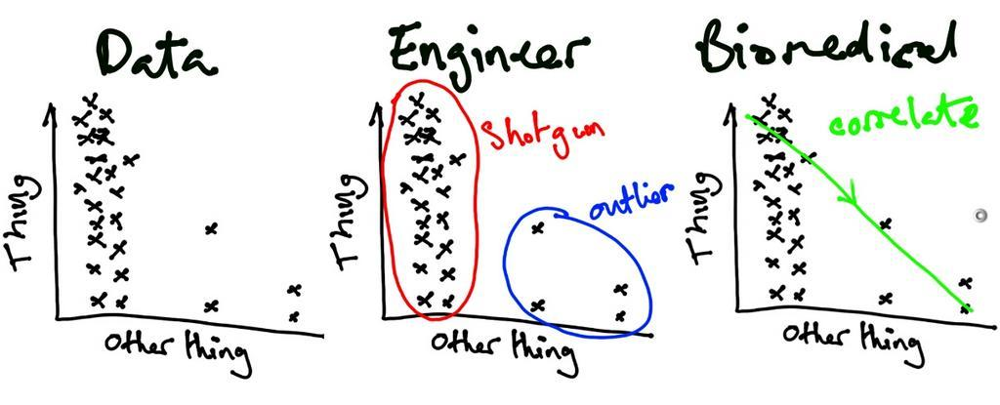
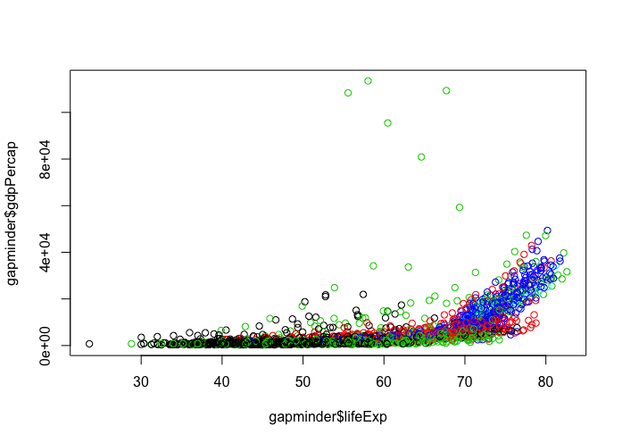
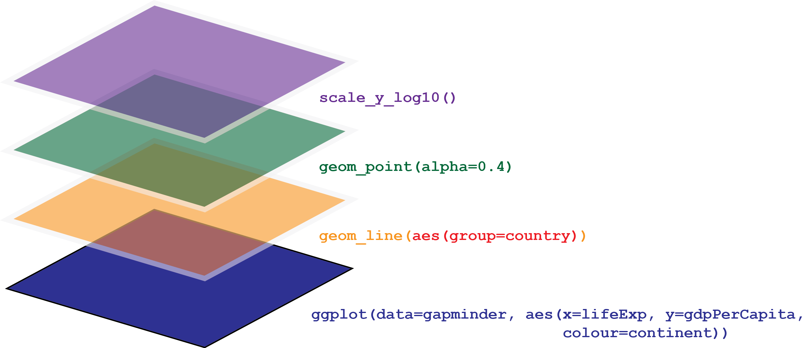
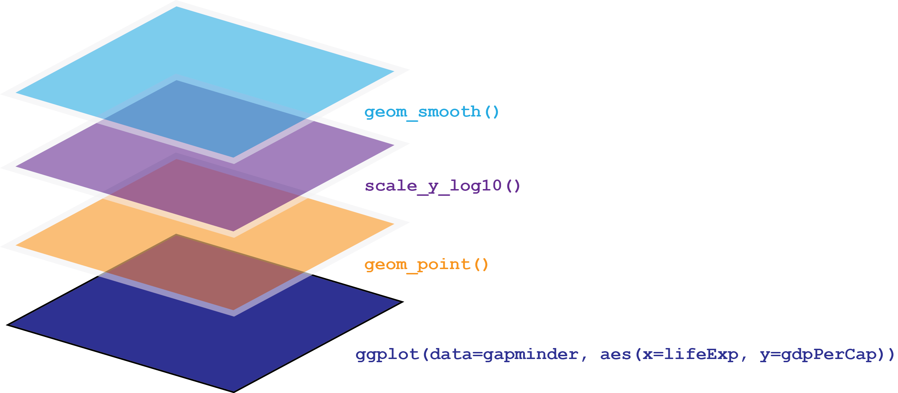
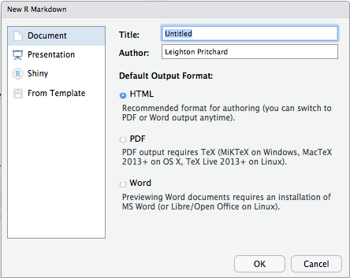
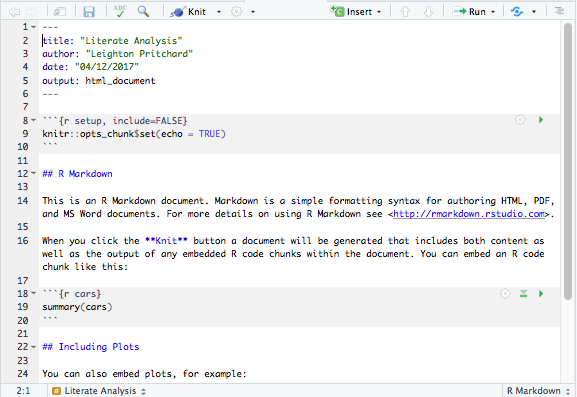
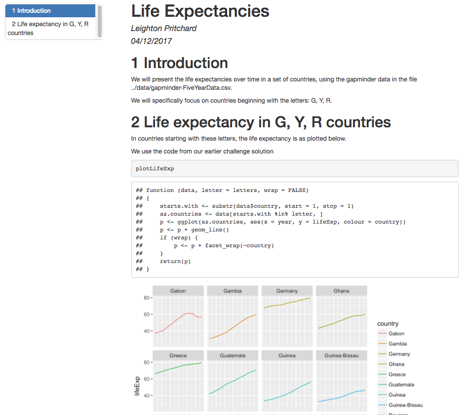
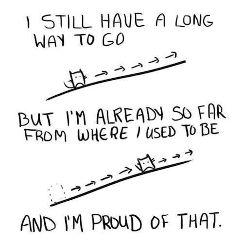
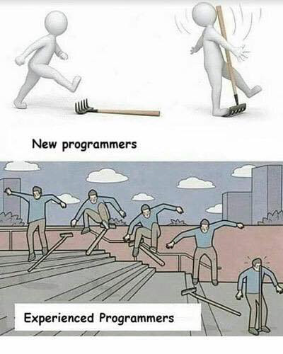
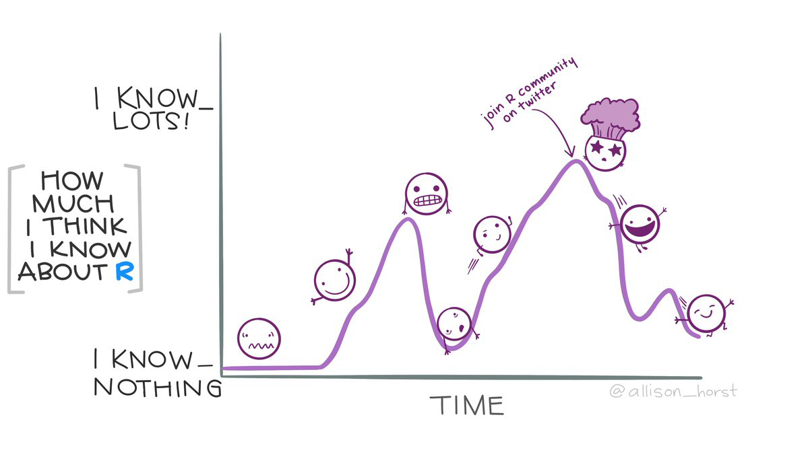

```{r}
#| label: setup

library(kableExtra)
library(tidyverse)
```

# 1. Summary and Setup

## Software and files

:::: { .columns }

::: { .column width="50%" }

- We will need the gapminder dataset
  - [https://swcarpentry.github.io/r-novice-gapminder/data/gapminder_data.csv](https://swcarpentry.github.io/r-novice-gapminder/data/gapminder_data.csv)

:::

::: { .column width="50%"}
{#fig-gapminder-qr}
:::

::::

# 2. Packages

## Packages

::: { .callout-tip title="R packages" }
- a collection (or *library*) of reusable code
- many useful and specialist tools are distributed as packages
- over 10,000 packages are available at `CRAN`
- you can distribute your own code as a package
:::

::: { .callout-important }
## INTERACTIVE DEMO

```R
installed.packages()               # see installed packages
install.packages("packagename")    # install a new package
update.packages()                  # update installed packages
library(packagename)               # import a package for use in your code
```
:::

::: {.footer}
CRAN - the Comprehensive `R` Archive Network: <https://cran.r-project.org/>
:::


## Challenge (2min)

::: { .callout-warning title="Check if the following packages are installed on your system, and install them if necessary."}

```R
dplyr
ggplot2
knitr
```
:::

# 3. Creating publication-quality graphics in R

## Visualisation is Critical!

{#fig-scientists-see-data}


## The Grammar of Graphics

::: { .callout-tip title="What is `ggplot2`?" }
- part of the *Tidyverse*, a collection of packages for data science
  - `ggplot2` is the graphics package
- **Implements the "Grammar of Graphics"**
  - Separates data from its representation
  - Helps iteratively update/refine plots
  - Helps build complex, effective visualisations from simple elements
:::

::: { .callout-important title="Four pillars of `ggplot2`" }
- *data*
- *aesthetics*
- `geom`s
- *layers*
:::

::: { .footer }
- Tidyverse: <https://www.tidyverse.org/>
:::

## A Basic Scatterplot

::: { .callout-tip title="You can use `ggplot2` like `R`'s base graphics" }

`qplot()` ≈ `plot()`
:::

::: { .callout-important title="INTERACTIVE DEMO"}
```R
library(ggplot2)
plot(gapminder$lifeExp, gapminder$gdpPercap, col=gapminder$continent)
qplot(lifeExp, gdpPercap, data=gapminder, colour=continent)
```
:::: { .columns }
::: { .column width="50%" }
{#fig-base-scatter width="70%"}
:::
::: { .column width="50%" }
{#fig-ggplot-scatter width="70%"}
:::
::::

:::

## What is a Plot? 1

:::: { .columns }

::: { .column width="60%" }

::: { .callout-tip title="Plot aesthetics" }
- Each observation in the *data* is a point
- A point's *aesthetics* determine how it is rendered
  - co-ordinates on the image; size; shape; colour
- *aesthetics* can be constant or mapped to variables
- **Many different plots can be generated from the same data by changing *aesthetics***
:::

:::
::: { .column width="40%" }

{#fig-qplot-scatter}
:::

::::

## What is a Plot? 2

::: { .callout-tip title="Plot `geom`s" }
- `geom` (short for *geometry*) defines the "type" of representation
  - If data are drawn as points: **scatterplot**
  - If data are drawn as lines: **line plot**
  - If data are drawn as bars: **bar chart** 
:::

{#fig-geom-types}

## What is a Plot? 3

::: { .callout-important title="INTERACTIVE DEMO" }

`ggplot2` offers several different `geom` types

```R
# Generate plot of GDP per capita against life Expectancy
p <- ggplot(data=gapminder, aes(x=lifeExp, y=gdpPercap, color=continent))
p + geom_point()
p + geom_line()
```
:::


## Challenge (2min)

::: { .panel-tabset }

## Problem

::: { .callout-warning title="Create a scatterplot showing how *life expectancy* changes as a function of *time*"}
:::

## Solution

```R
p <- ggplot(data=gapminder, aes(y=lifeExp, x=year, color=continent))
p
```

:::

## What is a Plot? 4

::: { .callout-tip title="We've just used another Grammar of Graphics concept: *layers*" }
- `ggplot2` plots are built as *layers*
- All *layers* have two components
  1. *data* and *aesthetics*
  2. a `geom`
:::


## What is a Plot? 5

::: { .callout-note title="*Data* and *aesthetics* can be defined in a *base* `ggplot` object" }
- values from the *base* are *inherited* by the other layers
- the *base* defaults can be overridden in other layers
:::

```R
p <- ggplot(data=gapminder, aes(x=lifeExp, y=gdpPercap, colour=continent))
p + geom_point()
```

{#fig-geom-layers-1}


## What is a Plot? 6

::: { .callout-note title="*Data* and *aesthetics* can be defined in a *base* `ggplot` object" }
- values from the *base* are *inherited* by the other layers
- the *base* defaults can be overridden in other layers
:::

```{r, eval=FALSE}
p <- ggplot(data=gapminder, aes(x=lifeExp, y=gdpPercap, colour=continent))
p + geom_line(aes(group=country))
```

{#fig-geom-layers-2}

::: { .callout-important title="INTERACTIVE DEMO" }
:::

## What is a Plot? 7

::: { .callout-note title="We use several layers of `geom`s to build up a plot" }
- `alpha` controls *opacity* for a layer
:::

```R
p <- ggplot(data=gapminder, aes(x=lifeExp, y=gdpPercap, color=continent))
p + geom_line(aes(group=country)) + geom_point(alpha=0.4)
```

{#fig-goem-layers-3}

::: { .callout-important title="INTERACTIVE DEMO" }
:::

## Challenge (5min)

::: { .panel-tabset }

## Problem

::: { .callout-warning title="Create a figure showing how *life expectancy* changes as a function of *time*" }
- Colour datapoints by continent, and use two layers:
  - a line plot, grouping points by country
  - a scatterplot showing each data point, with 35% opacity
:::

## Solution

```R
p <- ggplot(data=gapminder, aes(x=year, y=lifeExp, color=continent))
p + geom_line(aes(group=country)) + geom_point(alpha=0.35)
```

:::

## Transformations and `scale`s

::: { .callout-tip title="Data transformations are handled with `scale` layers" }
- axis scaling (log scales)
- colour scaling (changing palettes)
:::

{#fig-geom-layers-4}

::: { .callout-important title="**INTERACTIVE DEMO**" }
:::

## Statistics layers

::: { .callout-tip title="Some `geom` layers transform the dataset" }
- Usually this is a data summary (e.g. smoothing or binning, or fitting a model)
:::

{#fig-ggplot-layers-5}

::: { .callout-important title="**INTERACTIVE DEMO**" }
:::


## Multi-panel figures

::: { .callout-tip title="Comparisons can be clearer with multiple panels" }
- *facets*
- "small multiples plots"

Use the `facet_wrap()` layer to generate grids of plots
:::
    
::: { .callout-important title="**INTERACTIVE DEMO**" }

```R
# Compare life expectancy over time by continent
p <- ggplot(data=gapminder, aes(x=year, y=lifeExp, colour=continent,
                                group=country))
p <- p + geom_line() + scale_y_log10()
p + facet_wrap(~continent)
```
:::

## Challenge (5min)

::: { .panel-tabset }

## Problem

::: { .callout-warning title="Create a scatterplot and contour densities of GDP per capita against population size" }
- Fill datapoint colour by continent?
:::

::: { .callout-caution title="ADVANCED CHALLENGE" }
Transform the *x* axis to better visualise data spread, and use facets to panel density plots by year.
:::

## Solution

```R
p <- ggplot(data=gapminder, aes(x=pop, y=gdpPercap))
p <- p + geom_point(alpha=0.8, aes(color=continent))
p <- p + scale_y_log10() + scale_x_log10()
p + geom_density_2d(alpha=0.5) + facet_wrap(~year)
```

:::

# 4. Dynamic Reports

## Literate Programming

::: { .callout-tip title="What is literate programming?" }
- A *programming paradigm* introduced by Donald Knuth
- The program (or analysis) is explained in natural language
  - The *source code* is interspersed
- The whole document is *executable*
:::

::: { .footer }
- Literate Programming, by Donald Knuth: <http://www.literateprogramming.com/knuthweb.pdf>
:::


## R Markdown

::: { .callout-tip title="R Markdown files embody Literate Programming" }
- `File` $\rightarrow$ `New File` $\rightarrow$ `R Markdown`
- Enter a title
- Save the file (gets the extension `.Rmd`)
:::

:::: { .columns }

::: { .column width="50%" }
{#fig-rmarkdown-dialog width="60%"}
:::

::: { .column width="50%" }
{#fig-rmarkdown-start width="70%" }
:::

::::

## Components of `R Markdown` 1

::: { .callout-tip title="Header information" }
- File _metadata_
- Header is _fenced_ by `---`

```R
---
title: "Literate Programming"
author: "Leighton Pritchard"
date: "04/11/2025"
output: html_document
---
```
::: 

::: { .callout-tip title="Natural language" }
- Natural language is written as plain text

```R
This is an R Markdown document. Markdown is a simple formatting syntax
```
:::

## Components of `R Markdown` 2

::: { .callout-tip title="Executable `R` code" }

- Executable `R` code is *fenced* by *backticks* (```)
:::

::: { .callout-important title="**Click on `Knit`**" }
:::

## Creating a Report

::: { .callout-important title="**INTERACTIVE DEMO**" }
* We're going to create an `R Markdown` report on the `gapminder` data
:::

{#fig-rmarkdown-final}

::: { .footer }
- `R Markdown` documentation: <http://rmarkdown.rstudio.com/>
- `R Markdown` cheat sheet: <http://www.rstudio.com/wp-content/uploads/2015/02/rmarkdown-cheatsheet.pdf>
- Getting started with `R Markdown`: <https://www.rstudio.com/resources/webinars/getting-started-with-r-markdown/>
- Reproducible reporting: <https://www.rstudio.com/resources/webinars/reproducible-reporting/>
:::


# 12. Conclusion

## You have learned:

- About `R`, `RStudio` and how to set up a project
- How to load data into `R` and produce summary statistics and plots with *base* tools
- All the data types in `R`, the most important data structures
- How to install and use packages
- How to use the Tidyverse to manipulate and plot data
- How to create dynamic reports in `R`

::: { .callout-tip title="**WELL DONE!!**" }
:::

## The End Is The Beginning

:::: { .columns }

::: { .column width="50%" }
{#fig-long-way-to-go}
:::

::: { .column width="50%" }
{#fig-new-vs-experienced width="65%"}
:::

::::

## Where Next?

{#fig-impostor-syndrome}
