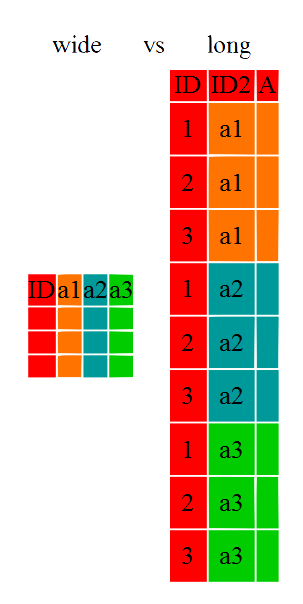
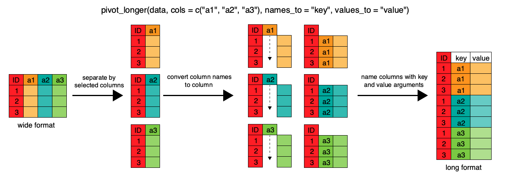

```{r}
#| label: setup

library(kableExtra)
library(tidyverse)
```

# 0. What are we doing?

::: footer

[Lesson: R for Reproducible Scientific Analysis](https://swcarpentry.github.io/r-novice-gapminder/index.html)

:::

## Learning Questions

- How can I read data in `R`?
- What are the basic data types in `R`?
- How can I manipulate a data frame?
- How can I manipulate data frames without repeating myself?

## Learning Objectives

- To be able to identify the main data types in `R`
- To explore data frames (and see how they are built from `R` data types)
- To be able to ask `R` about the type and structure of an object
- To be able to use the six main data frame manipulation ‘verbs’ with pipes in `dplyr`.
- To understand the concepts of ‘longer’ and ‘wider’ data frame formats and be able to convert between them with `tidyr`.

# 1. Data Types

::: footer

[Episode 4: Data Structures Part 1](https://swcarpentry.github.io/r-novice-gapminder/04-data-structures-part1.html)

:::

## Data Types and Structures in `R`

- `R` is mostly used for data analysis
- `R` has special *types* and *structures* to help you work with data
- Much of the focus in `R` is on tabular data (*data frames*) 

::: {.panel-tabset}

### Demo

::: { .callout-important }
## Interactive Demo

- toy dataset: `feline-data.csv`
:::

### Code

```{.r}
cats <- data.frame(coat = c("calico", "black", "tabby"),
                   weight = c(2.1, 5.0, 3.2),
                   likes_catnip = c(1, 0, 1))
```

:::


## What Data Types Do You Expect?

::: { .callout-warning }
## What data types would you expect to see?

What examples of data types can you think of from your own experience?
:::

::: { .callout-note }
## Please write in the chat

Add your suggestions of data types at:

[https://pad.carpentries.org/2025-06-16-strathclyde](https://pad.carpentries.org/2025-06-16-strathclyde)
:::

## Data Types in `R`

::: { .callout-caution }
## Data *types* in `R` are *atomic*

1. **logical**: `TRUE`, `FALSE`
2. **numeric**:
    * **integer**: `3`, `2L`, `123456`
    * **double** (*decimal*): `3.0`, `-23.45`, `pi`
3. **character** (*text*): `"a"`, `'SWC'`, `"This is not a string"`
:::

::: {.panel-tabset}

### Demo

::: { .callout-important }
## INTERACTIVE DEMO

- Inspecting data types
:::

### Code

```{.r}
> typeof(1L)
[1] "integer"
> typeof(cats$coat)
[1] "character"
> typeof("Irn Bru")
[1] "character"
```

:::

## A Quick Note About Dataframes

::: { .callout-tip }
## A column in a dataframe can contain only one data type
:::

- Adding a character string (`"2.3 or 2.4"`) to the column of `double`s changed its data type from `double` to `character`.

::: {.panel-tabset}

### Demo

::: { .callout-important }
## INTERACTIVE DEMO

- Coercion in dataframes
:::

### Code

```{.r}
> str(cats2)
'data.frame':	4 obs. of  3 variables:
 $ coat        : chr  "calico" "black" "tabby" "tabby"
 $ weight      : chr  "2.1" "5" "3.2" "2.3 or 2.4"
 $ likes_catnip: num  1 0 1 1
```

:::

# 2. Data Structures

::: footer

[Episode 4: Data Structures Part 1](https://swcarpentry.github.io/r-novice-gapminder/04-data-structures-part1.html)

:::

## Vectors

- Vectors are the most common data structure in `R`
- An _ordered collection_ of data
- Can contain only a single datatype

::: {.panel-tabset}

### Demo

::: { .callout-important }
## INTERACTIVE DEMO

- Understanding vectors
:::

### Code

```{.r}
> x <- c(10, 12, 45, 33)
> x
[1] 10 12 45 33
```

:::

## Coercion

::: {.panel-tabset}

### Demo

::: { .callout-important }
## INTERACTIVE DEMO

- A quiz
:::

### Code

```{.r}
> quiz_vector <- c(2,6,'3')
> typeof(quiz_vector)
```

:::

. . .

::: { .callout-caution }
## We need to be aware of datatypes and how `R` interprets them, otherwise we can meet some surprises
:::

::: {.panel-tabset}

### Demo

::: { .callout-important }
## INTERACTIVE DEMO

- Vector coercion
:::

### Code

```{.r}
> coercion_vector <- c('a', TRUE)
> coercion_vector
[1] "a"    "TRUE"
```

:::

## Coercion

::: { .callout-tip }
## Implicit coercion hierarchy

`logical` $\rightarrow$ `integer` $\rightarrow$ `double` $\rightarrow$ `complex` $\rightarrow$ `character`
:::

::: { .callout-warning}
## Check your inputs

**If there are formatting problems with your data, you might not have the type you expect when you import into `R`**
:::

::: {.panel-tabset}

### Demo

::: { .callout-important }
## INTERACTIVE DEMO

- Manual coercion
:::

### Code

```{.r}
[1] 10 12 45 33
> as.character(x)
[1] "10" "12" "45" "33"
> as.complex(x)
[1] 10+0i 12+0i 45+0i 33+0i
```

:::

## Lists

- `list`s are like *vectors*, but can hold *any combination of datatype*

::: {.panel-tabset}

### Demo

::: { .callout-important }
## INTERACTIVE DEMO

- Working with lists
:::

### Code

```{.r}
l <- list(1, 'a', TRUE, seq(2, 5))
```

:::

::: { .callout-tip }
## Working with list data

*elements* in a `list` are denoted by `[[]]` and individual elements can also be named
:::

# 3. Data Frames

::: footer

[Episode 5: Data Structures Part 2](https://swcarpentry.github.io/r-novice-gapminder/05-data-structures-part2.html)

:::

## Let's Look At A Data Frame

- The `cats` data is a `data.frame`

::: {.panel-tabset}

### Demo

::: { .callout-important }
## INTERACTIVE DEMO

- Data frame data structures
:::

### Code

```{.r}
> typeof(cats)
[1] "list"
> cats[[2]]
[1] 2.1 5.0 3.2
```

:::

. . . 

::: { .callout-note }
## A data frame is a special _named list_ of _vectors_ with the same length

- It's _like_ a spreadsheet, but each column must have a given type, and all columns must be the same length.
:::

## Load Episode Data

::: { .callout-caution }
## Where to find the data

- [https://raw.githubusercontent.com/swcarpentry/r-novice-gapminder/main/episodes/data/gapminder_data.csv](https://raw.githubusercontent.com/swcarpentry/r-novice-gapminder/main/episodes/data/gapminder_data.csv){preview-link="false"}
- Link available on the Etherpad ([https://pad.carpentries.org/2025-06-16-strathclyde](https://pad.carpentries.org/2025-06-16-strathclyde))
:::

::: { .callout-tip }
## Save the data to the `data` subfolder (where you put `feline-data.csv`)
:::


::: {.panel-tabset}

### Demo

::: { .callout-important }
## INTERACTIVE DEMO

- Load `gapminder` data
:::

### Code

```{.r}
gapminder <- read.table("data/gapminder_data.csv", sep=",", header=TRUE)
```

:::

## Investigating `gapminder`

::: {.panel-tabset}

### Demo

::: { .callout-important }
## INTERACTIVE DEMO

- What is the structure of the data?
- How many rows and columns?
- Summarising the data?
:::

### Code

```{.r}
str(gapminder)              # structure of the data.frame
typeof(gapminder$year)      # data type of a column
length(gapminder)           # length of the data.frame
nrow(gapminder)             # number of rows in data.frame
ncol(gapminder)             # number of columns in data.frame
dim(gapminder)              # number of rows and columns in data.frame
colnames(gapminder)         # column names from data.frame
head(gapminder)             # first few rows of dataframe
summary(gapminder)          # summary of data in data.frame columns
```

:::

# 4. Data Frame Manipulation With `dplyr`

::: footer

[Episode 12: Data Frame Manipulation with `dplyr`](https://swcarpentry.github.io/r-novice-gapminder/12-dplyr.html)

:::

## Learning Objectives

- How to manipulate `data.frame`s with the six *verbs* of `dplyr`
  - a 'grammar of data manipulation'

::: { .callout-note }
## `dplyr` verbs

- `select()`
- `filter()`
- `group_by()`
- `summarize()`
- `mutate()`
- `%>%` (pipe)
:::

## What and Why is `dplyr`?

- `dplyr` is another package in the *Tidyverse*
- Facilitates analysis by *groups* in Tidy Data
  - Helps avoid repetition
    
::: { .callout-tip }
Avoiding repetition (though automation) makes code

* **robust**
* **reproducible**
:::

## Split-Apply-Combine


## `select()`

{fig-align="center"}

::: {.panel-tabset}

### Demo

::: { .callout-important }
## INTERACTIVE DEMO

- Select specific columns for the whole dataset
:::

### Code

```{.r}
head(select(gapminder, year, country, gdpPercap))
gapminder %>% select(year, country, gdpPercap) %>% head()
```

:::

## `filter()`

::: { .callout-tip }
## `filter()` selects rows on the basis of some condition
:::

::: {.panel-tabset}

### Demo

::: { .callout-important }
## INTERACTIVE DEMO

- Select specific columns for a subset of rows
:::

### Code

```{.r}
filter(gapminder, continent=="Europe")

# Select gdpPercap by country and year, only for Europe
eurodata <- gapminder %>%
              filter(continent == "Europe") %>%
              select(year, country, gdpPercap)
```

:::

## Challenge (5min)

::: { .panel-tabset }

## Problem

::: { .callout-caution title="Challenge"}

Can you write a single line (which may span multiple lines in your script by including pipes) to produce a dataframe from `gapminder` containing:

- life expectancy, country, and year data
- only for African nations

- How many rows does the dataframe have?
:::

## Solution

```R
# Select life expectancy by country and year, only for Africa
> afrodata <- gapminder %>%
  filter(continent == "Africa") %>%
  select(year, country, lifeExp)
> nrow(afrodata)
[1] 624
```

:::

## `group_by()`

{fig-align="center"}


::: {.panel-tabset}

### Demo

::: { .callout-important }
## INTERACTIVE DEMO

- Split the dataset into groups on the basis of an ID value
:::

### Code

```{.r}
group_by(gapminder, continent)
gapminder %>% group_by(continent)
```

:::

## `summarize()`

{fig-align="center"}

::: {.panel-tabset}

### Demo

::: { .callout-important }
## INTERACTIVE DEMO

- Produce a summary for each group
:::

### Code

```{.r}
# Produce table of mean GDP by continent
gapminder %>% group_by(continent) %>%
              summarize(meangdpPercap=mean(gdpPercap))
```

:::

## Challenge (5min)

::: { .panel-tabset }

## Problem

::: { .callout-caution  title="Challenge" }
- Can you calculate the average life expectancy per *country* in the `gapminder` data?
- Which nation has longest life expectancy, and which the shortest?
:::

## Solution

```R
# Find average life expectancy by nation
avg_lifexp_country <- gapminder %>%
  group_by(country) %>%
  summarize(meanlifeExp=mean(lifeExp))
  
avg_lifexp_country %>% filter(meanlifeExp == min(meanlifeExp))

avg_lifexp_country %>% filter(meanlifeExp == max(meanlifeExp))
```

:::

## `count()` and `n()`

::: { .callout-tip }
## Two useful functions related to `summarize()`

- `count()`/`tally()`: a function that reports a table of counts by group
- `n()`: a function used *within* `summarize()`, `filter()` or `mutate()` to represent count by group
:::

::: {.panel-tabset}

### Demo

::: { .callout-important }
## INTERACTIVE DEMO

- Count number of rows meeting set criteria
- Calculate new summary statistic for a group
:::

### Code

```{.r}
gapminder %>%
  filter(year == 2002) %>%
  count(continent, sort = TRUE)

gapminder %>%
  group_by(continent) %>%
  summarize(se_lifeExp = sd(lifeExp)/sqrt(n()))
```

:::

## `mutate()`

::: { .callout-tip }
`mutate()` is a function allowing creation of new variables
:::

::: {.panel-tabset}

### Demo

::: { .callout-important }
## INTERACTIVE DEMO

- Generate new columns with processed data
:::

### Code

```{.r}
# Calculate GDP in $billion
gdp_bill <- gapminder %>%
  mutate(gdp_billion = gdpPercap * pop / 10^9)

# Calculate total/sd of GDP by continent and year
gdp_bycontinents_byyear <- gdp_bill %>%
    group_by(continent,year) %>%
    summarize(mean_gdpPercap=mean(gdpPercap),
              sd_gdpPercap=sd(gdpPercap),
              mean_gdp_billion=mean(gdp_billion),
              sd_gdp_billion=sd(gdp_billion))
```

:::

## `ifelse()`

::: { .callout-tip }
`ifelse()` allows us to restrict apply filtering when we use `mutate()`

- `ifelse([CONDITION], [VALUE IF TRUE], [VALUE IF FALSE]`)
:::

::: {.panel-tabset}

### Demo

::: { .callout-important }
## INTERACTIVE DEMO

- Apply calculations differently to rows that meet specified criteria
:::

### Code

```{.r}
gdp_billion_large_countries <- gapminder %>%
  mutate(gdp_billion_large = ifelse(pop > 10e6, 
                                    gdpPercap * pop / 10^9,
                                    NA))
```

:::

# 5. Tidy Data

::: footer

[Episode 13: Data Frame Manipulation with `tidyr`](https://swcarpentry.github.io/r-novice-gapminder/13-tidyr.html)

:::

## Why Tidy Data?

> "Tidy datasets are all alike, but every messy dataset is messy in its own way"

::: { .callout-caution }
## Data Cleaning is not just a first step

- Cleaning is needed whenever new data turns up, new ideas arrive, etc.
- About 80% of the effort of data analysis is cleaning and preparing data

**Principles of _Tidy Data_ provide a standard way to organise data values within a dataset**
:::

## An Untidy Dataset (1)

::: { .callout-warning }
## What's wrong with this data?
:::

```{r}
df1 <- data.frame(treatment=c("treatment.A", "treatment.B"),
                  John.Smith=c(NA, 2),
                  Jane.Doe=c(16, 11),
                  Mary.Johnson=c(3, 1))
colnames(df1) = c("", "John Smith", "Jane Doe", "Mary Johnson")
```

```{r, echo=FALSE}
kable(df1)
```

## An Untidy Dataset (2)

::: { .callout-warning }
## Is this better?
:::

```{r}
df2 <- data.frame(name=c("John Smith", "Jane Doe", "Mary Johnson"),
                 treatment.A=c(NA, 16, 3),
                 treatment.B=c(2, 11, 1))
colnames(df2) = c("", "treatment.A", "treatment.B")
```

```{r, echo=FALSE}
kable(df2)
```

. . .

::: { .callout-caution }
## We need to talk about data semantics
:::

## Data Semantics

::: { .callout-tip }
## A dataset is a collection of **VALUES**
:::

```{r, echo=FALSE}
kable(df1)
```

::: { .callout-note }
## Each **value** belongs to a **variable** and an **observation**

- **VARIABLES** (can *change* or *vary*): values that are *measured* or *decided* by a researcher: height, temperature, duration, treatment, etc.
- **OBSERVATIONS**: values measured across all variables for the same individual/unit/group: person, reactor, religion, company, etc.
:::

## Challenge (2min) {.quiz-question .smaller}

::: { .callout-warning title="In the table below, what are the rows and columns?"}
```{r, echo=FALSE}
kable(df1)
```

:::

- [Rows=OBERVATIONS, Columns=VARIABLES]{data-explanation="A person's name cannot vary so it is not a variable, and treatment here is not a collection of values measured across all variables"}
- [Rows=OBERVATIONS, Columns=NEITHER]{data-explanation="Treatment here is not a collection of values measured across all variables"}
- [Rows=NEITHER, Columns=VARIABLES]{data-explanation="A person's name cannot vary so it is not a variable"}
- [Rows=NEITHER, Columns=NEITHER]{.correct}

## A Tidy Dataset (1)

::: { .callout-caution }
## The dataset contains 18 values

There are three variables and six observations
:::

::: { .callout-note }
## VARIABLES

- person (three people: John, Mary, Jane)
- treatment (two treatments: a and b)
- result (six measurements: `NA`, 16, 3, 2, 11, 1)
:::

```{r, echo=FALSE}
df3<- data.frame(name=c("John Smith", "Jane Doe", "Mary Johnson",
                         "John Smith", "Jane Doe", "Mary Johnson"),
                  treatment=c("a", "a", "a", "b", "b", "b"),
                  result=c(NA, 16, 3, 2, 11, 1))
```


::: { .callout-important }
Each **OBSERVATION** includes all three variables
:::

## A Tidy Dataset (2)

:::: {.columns}

::: {.column width="40%"}
::: { .callout-tip }
## This is the dataset in tidy form

(aka _long form_)
:::
:::

::: {.column width="60%"}
```{r, echo=FALSE}
kable(df3)
```
:::

::::

## Tidy Data

::: { .callout-tip }
## Tidy data is a standard way of structuring a dataset

1. Each **VARIABLE** forms a column
2. Each **OBSERVATION** forms a row

makes it easy to extract needed variables, and well suited to `R` (supports vectorisation)
:::

::: {.panel-tabset}

### Demo

::: { .callout-important }
## INTERACTIVE DEMO

- Inspect `gapminder` data
:::

### Code

```{.r}
head(gapminder)
```

:::

## Long v Wide

:::: {.columns}

::: {.column width="60%"}
::: { .callout-warning }
## Many `R` functions are designed to expect long data

- Long data: each column is a variable, each row is an observation
- Wide data: each row might be a subject, each column an observation variable
:::
:::

::: {.column width="40%"}
{fig-align="center"}
:::

::::

## `gapminder` Wide Dataset

::: { .callout-caution }
## Where to find the data

- [https://swcarpentry.github.io/r-novice-gapminder/data/gapminder_wide.csv](https://swcarpentry.github.io/r-novice-gapminder/data/gapminder_wide.csv){preview-link="false"}
- Link available on the Etherpad ([https://pad.carpentries.org/2025-06-16-strathclyde](https://pad.carpentries.org/2025-06-16-strathclyde))
:::

::: {.panel-tabset}

### Demo

::: { .callout-important }
## INTERACTIVE DEMO

- Load and inspect the data
:::

### Code

```{.r}
gap_wide <- read.csv("data/gapminder_wide.csv", stringsAsFactors = FALSE)
str(gap_wide)
```

:::

## Pivot: Wide to Long

{fig-align="center"}

::: {.panel-tabset}

### Demo

::: { .callout-important }
## INTERACTIVE DEMO

- Pivot wide to long
:::

### Code

```{.r}
gap_long <- gap_wide %>%
  pivot_longer(
    cols = c(starts_with('pop'), starts_with('lifeExp'),
             starts_with('gdpPercap')),
    names_to = "obstype_year", values_to = "obs_values"
  )
```

:::

## `separate()`

::: { .callout-tip }
`separate()` allows us to split the contents of one column into several columns

- `separate([COLUMN], into=[NEW_COLUMN_NAMES], sep=[SEPARATOR])`
:::

::: {.panel-tabset}

### Demo

::: { .callout-important }
## INTERACTIVE DEMO

- Split one column into two
:::

### Code

```{.r}
gap_long %>% separate(obstype_year,
                      into = c('obs_type', 'year'),
                      sep = "_")
```

:::

## Pivot: Long to Wide

{fig-align="center"}

::: {.panel-tabset}

### Demo

::: { .callout-important }
## INTERACTIVE DEMO

- Pivot wide to long
:::

### Code

```{.r}
gap_normal <- gap_long %>%
  pivot_wider(names_from = obs_type,
              values_from = obs_values)
```

:::

## Challenge (5min)

::: { .panel-tabset }

## Problem

::: { .callout-caution title="Challenge"}
Using the `gap_long` dataset, calculate the mean life expectancy, population, and GDP per capita for each continent.

Hint: use the `group_by()` and `summarize()` functions we learned in the `dplyr` episode.
:::

## Solution

```R
gap_long %>% group_by(continent, obs_type) %>%
   summarize(means=mean(obs_values))
```

:::

