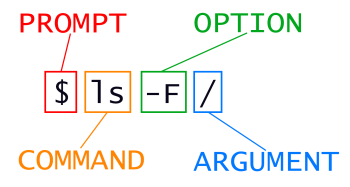
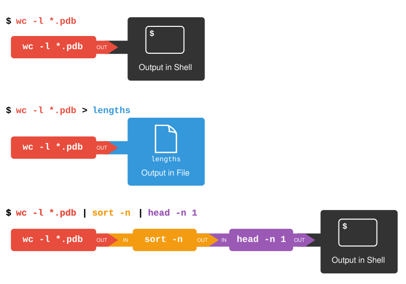

# 1. Summary and Setup

## Software and files

:::: { .columns }

::: { .column width="60%" }

- University PC: use `Git Bash`
- Windows laptop: use `Git Bash` or `WSL`
- Mac laptop: use `Terminal` (or equivalent)
- Linux laptop: use `Bash` shell

::: { .callout-important }
- You will need to download some files to follow this lesson
  - [https://swcarpentry.github.io/shell-novice/data/shell-lesson-data.zip](https://swcarpentry.github.io/shell-novice/data/shell-lesson-data.zip)
  - Place this file on your desktop and unzip it
:::

:::

::: { .column width="40%" }
{#fig-data-download}
:::

::::

# 2. Nelle's pipeline

## Nelle's project

> Nelle Nemo, a marine biologist, has just returned from a six-month survey of the North Pacific Gyre, where she has been sampling gelatinous marine life in the Great Pacific Garbage Patch.
>
> She has 1520 samples that she’s run through an assay machine to measure the relative abundance of 300 proteins.
>
> She needs to run these 1520 files through an imaginary program called `goostats.sh`. In addition to this huge task, she has to write up results by the end of the month, so her paper can appear in a special issue of _Aquatic Goo Letters_.

## Nelle's pipeline

- You'll need to know how to:
  - *navigate to* a file/directory
  - *create* a file/directory
  - *check the length of a file*
  - *chain commands* together
  - *retrieve* a set of files
  - *iterate* over files
  - *run a shell script containing your pipeline*
  
# 3. Navigating files and directories

## Filesystem structure

{#fig-filesystem}

## Home directories

{#fig-filesystem-homes}

## Challenge (1min) {.quiz-question}

::: { .callout-warning title="`ls -rt` displays which file _last_?"}
`ls -t` lists items by time of last change,
`ls -r` reverses the list order 
:::

- [filename that starts earliest in alphabet]{data-explanation="`ls` orders files alphabetically by default"}
- [most recently modified file]{.correct}
- [earliest modified file]{data-explanation="`ls -t` orders files from most recent to oldest modification"}
- [filename that starts latest in alphabet]{data-explanation="`ls -r` reverses alphabetical order"}

## Challenge (1min) {.quiz-question}

::: { .callout-warning title="Starting from `/Users/nelle/data` how can you navigate to Nelle's home directory?"}
:::

- [`cd .`]{data-explanation="`cd .` stays in the same directory"}
- [`cd /`]{data-explanation="`cd /` moves to the filesystem root"}
- [`cd ~`]{.correct}
- [`cd home`]{data-explanation="There is no `home` directory"}
- [`cd`]{.correct}
- [`cd ..`]{.correct}

## Challenge (1min) {.quiz-question .smaller}

:::: { .columns }

::: { .column width=40% }

::: { .callout-warning title="If `pwd` returns `/Users/backup` what command gives the output below?"}
`pnas_sub pnas_final/ original`
:::

:::

::: { .column width=60% }

{#fig-filesystem-challenge .data-preview-image}

:::

:::: 

- [`ls pwd`]{data-explanation="There is no `pwd` directory"}
- [`ls -r -F`]{.correct}
- [`ls -r -F /Users/backup`]{.correct}

# 4. Shell command syntax

## Shell command components

{#fig-shell-command}

# 5. Working with files and directories

## Good names for files and directories

::: { .callout-tip title="Use descriptive filenames" }
`2025-10-11_lcms_clean.csv` rather than `some_data.csv`
:::

::: { .callout-tip title="Use a limited set of characters" }
Stick to lower-case and a restricted set of special characters to avoid clashes with special instructions

`[a-z][0-9].-_`
:::

::: { .callout-important title="Don't use spaces"}
- `% ls my-folder` will show the contents of `my-folder`
- `$ ls my folder` will attempt to show the contents of `my` and `folder`
:::

::: { .callout-important title="Don't start a name with a dash"}
Commands treat these as options
:::

## File extensions

- Most filenames come in two parts, like `draft.txt`
  - `draft` is the **filestem**
  - `.txt` is the **extension**
  
::: { .callout-tip title="File extensions indicate content type" }
- `.txt`: plain text
- `.pdf`: PDF document
- `.cfg`: configuration file
:::

::: { .callout-important title="Extension matching content is a **convention** only" }
Changing a file extension does not change the file content
:::

## Challenge (1min) {.quiz-question}

::: { .callout-warning title="You accidentally called your file `statstics.txt`"}
How do you rename it to `statistics.txt`?
:::

- [`cp statstics.txt statistics.txt`]{data-explanation="This copies the file, so the original would need to be deleted"}
- [`mv statstics.txt statistics.txt`]{.correct}
- [`cp statstics.txt .`]{data-explanation="This would attempt to copy the file to its own current location"}
- [`mv statstics.txt .`]{data-explanation="This would attempt to move the file to its own current location"}

## Challenge (1min) {.quiz-question}

::: { .callout-warning title="Which `ls` command produces the output below?"}
`alkanes/ethane.pdb alkanes/methane.pdb`
:::

- [`ls alkanes/*t*ane.pdb`]{data-explanation="`alkanes/ethane.pdb   alkanes/methane.pdb  alkanes/octane.pdb   alkanes/pentane.pdb`"}
- [`ls alkanes/*t?ne.*`]{data-explanation="`alkanes/octane.pdb   alkanes/pentane.pdb`"}
- [`ls alkanes/*t??ne.pdb`]{.correct}
- [`ls alkanes/ethane.*`]{data-explanation="`alkanes/ethane.pdb`"}

# 5. Pipes and Filters

## Combining multiple commands

{#fig-redirects-pipes}

## Challenge (1min) {.quiz-question}

::: { .callout-warning title="Which command shows the three files with fewest lines?"}
:::

- [`wc -l * > sort -n > head -n 3`]{data-explanation="This attempts redirection to a file called sort"}
- [`wc -l * | sort -n | head -n 1-3`]{data-explanation="This is incorrect input to head"}
- [`wc -l * | head -n 3 | sort -n`]{data-explanation="This inverts the order of sort and head"}
- [`wc -l * | sort -n | head -n 3`]{.correct}

# 6. Loops

## The structure of a loop

```{.bash code-line-numbers="|2|4,6,8|4|8|6"}
# The word "for" indicates the start of a "For-loop" command
for thing in list_of_things 
#The word "do" indicates the start of job execution list
do 
    # Indentation within the loop is not required, but aids legibility
    operation_using/command $thing 
# The word "done" indicates the end of a loop
done  
```

## Challenge (3min)

::: { .panel-tabset }

## Problem

::: { .callout-warning title="Write your own loop"}
Write a loop that echoes all ten numbers from 0 to 9
:::

## Solution

::: { .callout-warning title="Write your own loop"}
Write a loop that echoes all ten numbers from 0 to 9
:::

::: { .callout-tip title="Solution" }
```bash
$ for loop_variable in 0 1 2 3 4 5 6 7 8 9
> do
>     echo $loop_variable
> done
```
:::

:::

# 7. Shell Scripts

